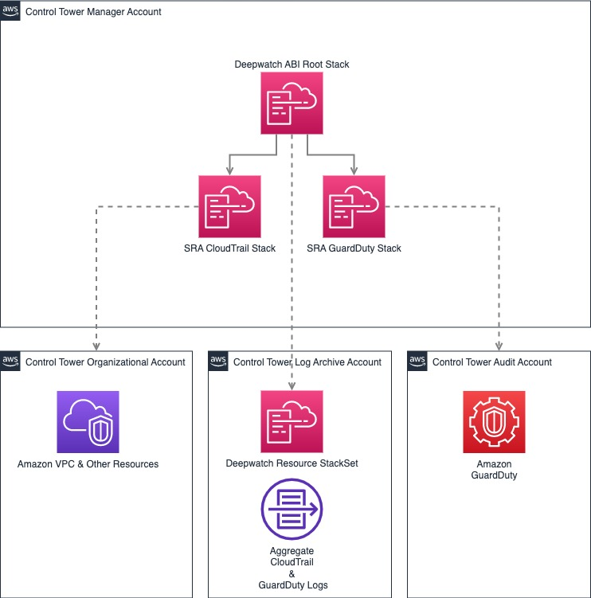

# Deepwatch Amazon Built In Module 

## Overview



This solution utilizes CloudFormation to deploy three solutions as one:

- Solution A: A CloudFormation Nested Stack that deploys an Organization CloudTrail solution that will create an Organization CloudTrail within the Organization Management Account that is encrypted with a Customer Managed KMS Key managed in the Audit Account and logs delivered to the Log Archive Account. An Organization CloudTrail logs all events for all AWS accounts in the AWS Organization.
- Solution B: A CloudFormation Nested Stack that enables GuardDuty for all existing AWS accounts in an AWS Organization and turns on the Auto-Enable feature for future accounts. The solution allows you to choose the regions in which to enable GuardDuty and delegates the GuardDuty administrator role to the organization's Audit account. It creates an S3 bucket in the logging account to collect aggregated findings from all accounts and assigns a lifecycle policy to transition data to Glacier storage after 365 days. The solution also enables GuardDuty S3 and EKS protection by default. 
- Solution C: A StackSet in the logging account account where the previous solutions were configured to store logs to and sets ups all of the resources required to begin ingesting those logs to the Deepwatch Managed Detection & Response platform, including all necessary Lambdas, SNS Topics, SQS Queues, S3 Event Notifications, and IAM Roles & Policies. The outputs of this StackSet are all that is needed to finish setting up ingestion of your organizations CloudTrail and GuardDuty logs.

## Getting Started

To deploy this CloudFormation Stack via the AWS Console follow these steps:

1. Clone this repository to your local machine.
2. Open the AWS Management Console and navigate to CloudFormation.
3. Create a new CloudFormation Stack.
4. Choose to upload a template file and select the "deepwatch-root-stack.yaml" file.
5. Enter your desired Stack name and fill in the required parameters.
6. Click "Create Stack" to begin the deployment process.

To deploy the CloudFormation stack using the AWS CLI follow these steps:

1. Clone this repository to your local machine.
2. Install and configure the AWS CLI on your machine.
3. Open your terminal or command prompt and navigate to the directory where you cloned the repository.
4. Run the following command to create the CloudFormation stack:

   ```
   aws cloudformation create-stack --stack-name <YOUR_STACK_NAME> --template-body file://deepwatch-root-stack.yaml --parameters ParameterKey=<PARAMETER_NAME>,ParameterValue=<PARAMETER_VALUE> --capabilities CAPABILITY_NAMED_IAM
   ```

   Be sure to replace `<YOUR_STACK_NAME>`, `<PARAMETER_NAME>`, and `<PARAMETER_VALUE>` with your desired values for the stack name and parameters.

5. Wait for the stack to finish deploying. You can check the status of the deployment by running the following command:

   ```
   aws cloudformation describe-stacks --stack-name <YOUR_STACK_NAME>
   ```

   The stack status will be returned in the output.

Once the stack has finished deploying, you can access the resources created by the stack via the AWS Management Console or the AWS CLI.

## Deepwatch StackSet Resources 

[diagram here]

The Deepwatch CloudFormation StackSet creates several AWS resources:

- `GuardDutyQueue`: an SQS queue that receives events for preprocessing.
- `GuardDutyQueuePolicy`: an SQS queue policy that grants permissions to access the preprocessing queue.
- `GuardDutyDeadLetterQueue`: an SQS queue that acts as a dead-letter queue for a preprocessing queue.
- `GuardDutyDeadLetterQueuePolicy`: an SQS queue policy that grants permissions to access the dead-letter queue for the preprocessing queue.
- `ControlTowerSNSTopic`: an SNS topic that sends notifications about events to the preprocessing queue.
- `ControlTowerPreProcessedQueue`: an SQS queue that receives events for preprocessing.
- `ControlTowerPreProcessedQueuePolicy`: an SQS queue policy that grants permissions to access the preprocessing queue.
- `ControlTowerPreProcessedDeadLetterQueue`: an SQS queue that acts as a dead-letter queue for a preprocessing queue.
- `ControlTowerPreProcessedDeadLetterQueuePolicy`: an SQS queue policy that grants permissions to access the dead-letter queue for the preprocessing queue.
- `ControlTowerPreProcessedLambdaFunction`: a lambda function that is triggered by message arrival to the ControlTowerPreProcessedQueue to process CloudTrail logs.
- `CloudTrailQueue`: an SQS queue that receives CloudTrail events.
- `CloudTrailQueuePolicy`: an SQS queue policy that grants permissions to access the CloudTrail queue.
- `CloudTrailDeadLetterQueue`: an SQS queue that acts as a dead-letter queue for the CloudTrailQueue.
- `CloudTrailDeadLetterQueuePolicy`: an SQS queue policy that grants permissions to access the dead-letter queue for the CloudTrail queue.

Additionally there is a custom resource that will place an event notification configuration on the GuardDuty and CloudTrail buckets to forward all new objectcreate events to the respective SQS queue/SNS Topic.

## Post-Deployment Steps

Following the deployment of the solution, please provide your Deepwatch engineer with the following outputs from the Deepwatch template:

- `oCloudTrailQueueArn`
- `oGuardDutyQueueArn`
- `oDeepwatchRoleArn`